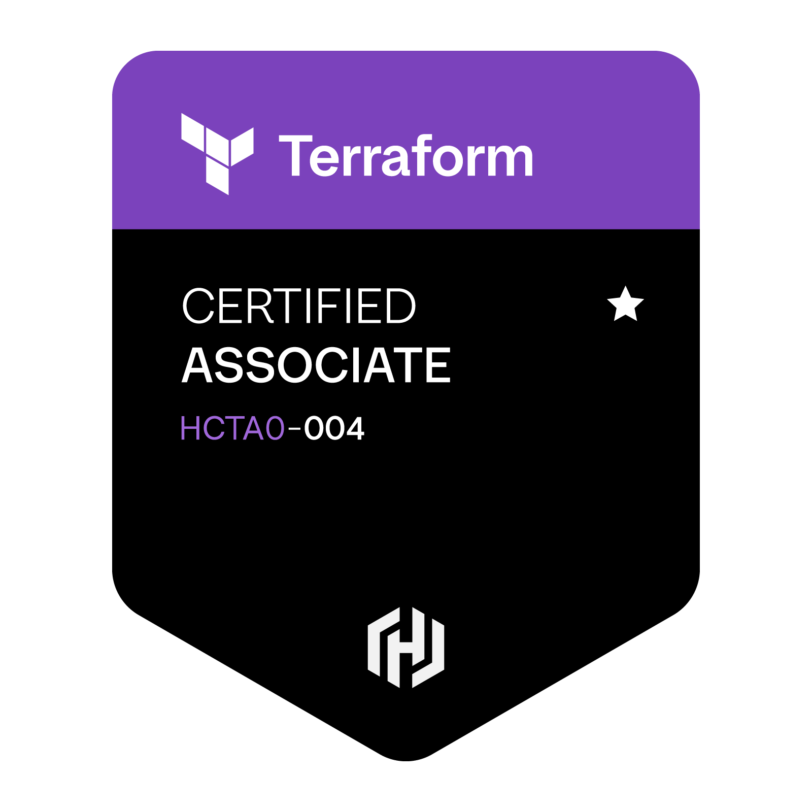

# Terraform Mastery

<p align="center">
  
</p>

A complete study repository for the **HashiCorp Certified: Terraform Associate (004)** exam — and a practical way to learn Terraform from fundamentals to HCP Terraform.

Whether you are preparing for certification or learning Infrastructure as Code, this repo gives you **notes, hands-on examples, and practice questions** mapped to every official exam domain.

---

## What this repo is about

Terraform Mastery is structured like the real exam: **nine domains**, each with:

1. **Study notes** — concepts, exam traps, and quick self-checks  
2. **Runnable examples** — small Terraform labs you can `init` / `plan` / `apply` locally  
3. **Practice questions** — 60 exam-style questions per domain (540 total)

It also includes a **10-day preparation guide** so you can follow a clear study path instead of jumping between random tutorials.

---

## Features

- **Exam-aligned content** — mirrors HashiCorp Associate 004 domains and weightage  
- **540 practice questions** — single-choice and multi-select, with explanations  
- **Hands-on labs** — offline-friendly examples using `local` / `random` providers (no cloud account required for most labs)  
- **10-day study plan** — day-by-day checklist in [`preparation.md`](preparation.md)  
- **Linked learning path** — notes → examples → questions for every topic  
- **Clean project layout** — standard Terraform file patterns (`versions.tf`, modules, outputs, state notes)  
- **Safe defaults** — no hardcoded cloud credentials; secrets and state files are gitignored  

---

## Topics covered

| # | Topic | What you learn | Exam weight |
|---|--------|----------------|-------------|
| 01 | **Infrastructure as Code** | Declarative vs imperative, idempotency, drift, IaC benefits | 5–7% |
| 02 | **Purpose of Terraform** | Terraform vs Ansible / CloudFormation / Pulumi, providers, multi-cloud | 7–9% |
| 03 | **Terraform Basics** | HCL, providers, version constraints (`~>`), project structure, lock file | 10–12% |
| 04 | **Terraform CLI** | `fmt`, `validate`, `console`, `output`, `show`, workspaces, import, provisioners | 8–10% |
| 05 | **Modules** | Root vs child modules, sources, inputs/outputs, Registry modules | 8–10% |
| 06 | **Core Workflow** | Write → init → plan → apply → destroy, saved plan files | 8–10% |
| 07 | **State Management** | State purpose, backends, locking, drift, `terraform state` commands | 12–15% |
| 08 | **Configuration** | Variables, outputs, `count` / `for_each`, dynamic blocks, functions, sensitive values | 15–18% |
| 09 | **HCP Terraform** | Remote state, workspaces, VCS-driven runs, private registry, `cloud {}` block | 8–10% |

Highest priority for the exam: **Configuration (08)**, **State (07)**, **Basics (03)**.

---

## Quick start

### Prerequisites

- [Terraform](https://developer.hashicorp.com/terraform/install) CLI installed  
- A text editor (VS Code / Cursor recommended for Markdown preview)

### Study flow

```text
1. Read notes/{topic}/notes.md
2. Run examples/{topic}/…
3. Practice questions/{topic}/questions.md
4. Revisit weak areas
```

### Try an example (no cloud credentials needed)

```bash
cd examples/01-infrastructure-as-code/declarative-local-file
terraform init
terraform apply -auto-approve
# Run apply again → no changes (idempotent)
```

Full lab index: [`examples/README.md`](examples/README.md)

---

## Repository structure

```text
Terraform-Mastery/
├── README.md              # You are here
├── preparation.md         # 10-day exam preparation guide
├── notes/                 # Domain study notes (01–09)
├── examples/              # Runnable Terraform labs (01–09)
└── questions/             # 540 practice questions (01–09)
```

| Path | Purpose |
|------|---------|
| [`notes/`](notes/README.md) | Learn concepts and exam traps |
| [`examples/`](examples/README.md) | Practice with real `.tf` configs |
| [`questions/`](questions/README.md) | Test yourself (answers in dropdowns) |
| [`preparation.md`](preparation.md) | Day-by-day study plan + checklists |

---

## Domain links

| # | Domain | Notes | Examples | Questions |
|---|--------|-------|----------|-----------|
| 1 | Understand IaC | [notes](notes/01-infrastructure-as-code/notes.md) | [lab](examples/01-infrastructure-as-code/declarative-local-file/) | [60 Q](questions/01-infrastructure-as-code/questions.md) |
| 2 | Purpose of Terraform | [notes](notes/02-terraform-purpose/notes.md) | [lab](examples/02-terraform-purpose/provider-agnostic/) | [60 Q](questions/02-terraform-purpose/questions.md) |
| 3 | Terraform Basics | [notes](notes/03-terraform-basics/notes.md) | [lab](examples/03-terraform-basics/provider-versions-resource/) | [60 Q](questions/03-terraform-basics/questions.md) |
| 4 | Terraform CLI | [notes](notes/04-terraform-cli/notes.md) | [lab](examples/04-terraform-cli/fmt-validate-console/) | [60 Q](questions/04-terraform-cli/questions.md) |
| 5 | Modules | [notes](notes/05-modules/notes.md) | [lab](examples/05-modules/local-file-module/) | [60 Q](questions/05-modules/questions.md) |
| 6 | Core Workflow | [notes](notes/06-core-workflow/notes.md) | [lab](examples/06-core-workflow/init-plan-apply/) | [60 Q](questions/06-core-workflow/questions.md) |
| 7 | State Management | [notes](notes/07-state-management/notes.md) | [lab](examples/07-state-management/state-and-backends/) | [60 Q](questions/07-state-management/questions.md) |
| 8 | Configuration | [notes](notes/08-configuration/notes.md) | [4 labs](examples/08-configuration/) | [60 Q](questions/08-configuration/questions.md) |
| 9 | HCP Terraform | [notes](notes/09-hcp-terraform/notes.md) | [lab](examples/09-hcp-terraform/cloud-block/) | [60 Q](questions/09-hcp-terraform/questions.md) |

---

## Who is this for?

- Candidates preparing for **Terraform Associate 004**
- Engineers learning Terraform / IaC for the first time
- Anyone who wants structured notes + labs + quiz practice in one place

---

## Security notes

- Do **not** put cloud access keys in `.tf` files — use environment variables, AWS CLI profiles, or IAM roles
- `.env`, `*.tfstate`, and `*.tfvars` are ignored by Git
- If you previously committed credentials anywhere, rotate them in your cloud provider immediately

---

## Official resources

- [HashiCorp Associate 004 Study Guide](https://developer.hashicorp.com/terraform/tutorials/certification-004/associate-study-004)
- [Official Sample Questions](https://developer.hashicorp.com/terraform/tutorials/certification-004/associate-review-004)

---

## License / contributing

This is a personal study repository. Feel free to fork it, adapt the notes, and add your own labs. Pull requests that improve accuracy against the official exam objectives are welcome.
